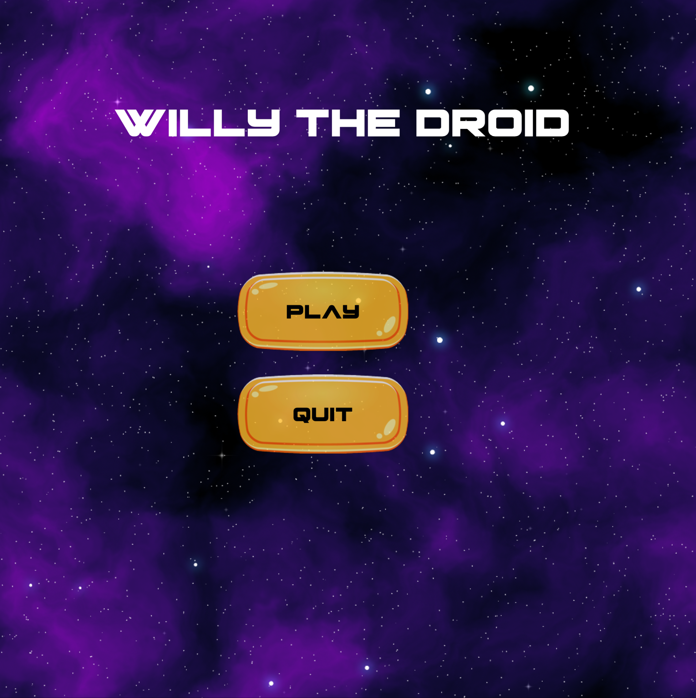
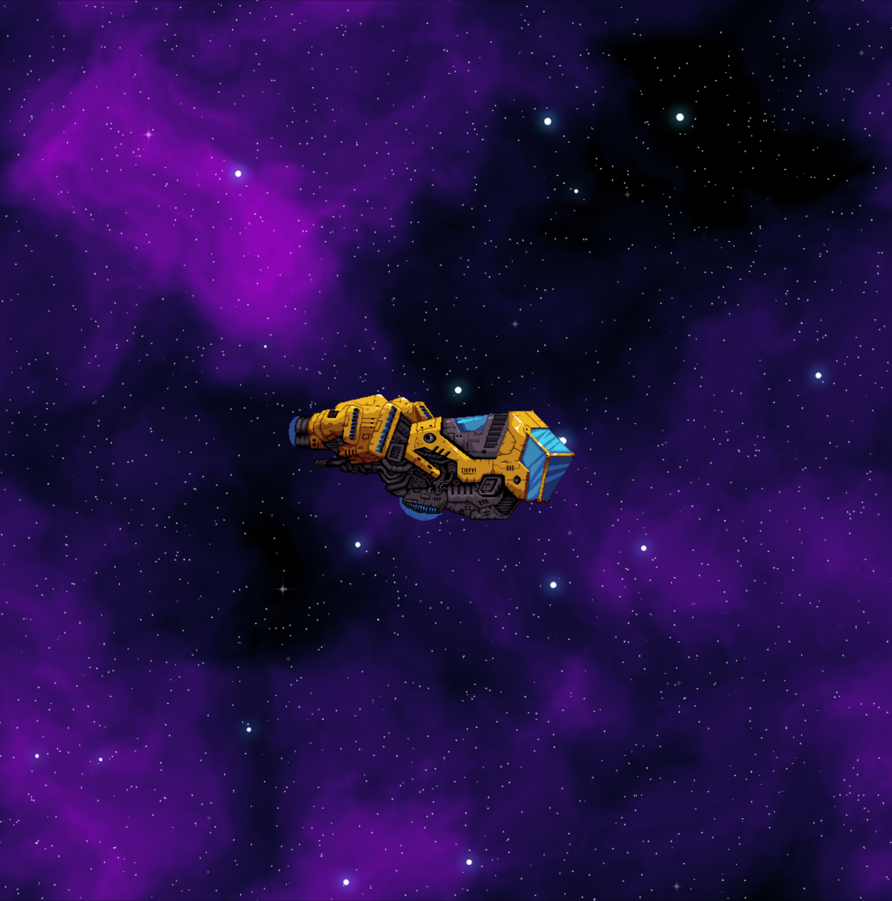
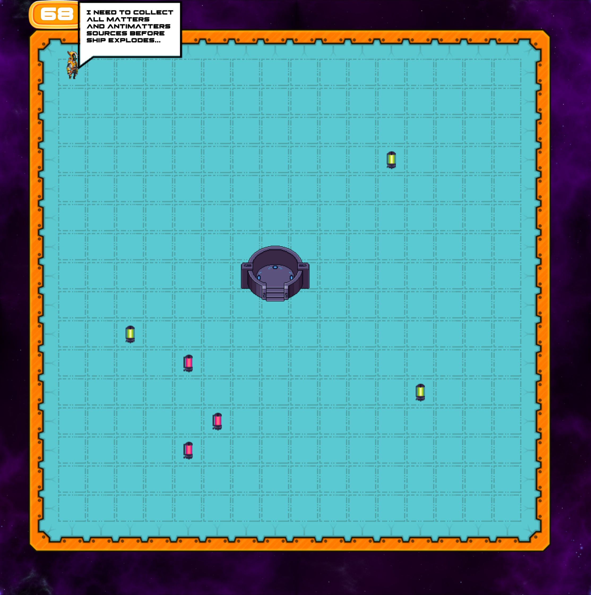

# Willy The Android

A 2D puzzle game.
Made with Ruby and [MiniGL](https://github.com/victords/minigl).

## Getting started
- install dependencies. [Mac OS](https://github.com/gosu/gosu/wiki/Getting-Started-on-OS-X), [Linux](https://github.com/gosu/gosu/wiki/Getting-Started-on-Linux)
- `bundle install`

## Running
`ruby src/main.rb`

## Screenshots

## Assets attribution
- https://ansimuz.itch.io/warped-vehicles
- https://screamingbrainstudios.itch.io/seamless-space-backgrounds
- https://cga-creative-game-assets.itch.io/gold-2d-mobile-ui-for-casual-game
- https://www.fontspace.com/pilot-command-font-f71691
- https://void1gaming.itch.io/halftone-sound-effects-pack-lite
- https://penusbmic.itch.io/sci-fi-character-pack-6
- https://helleworld.itch.io/industrialscifi-top-down-tileset
- https://xenophero.itch.io/sci-fi-furniture-sprites